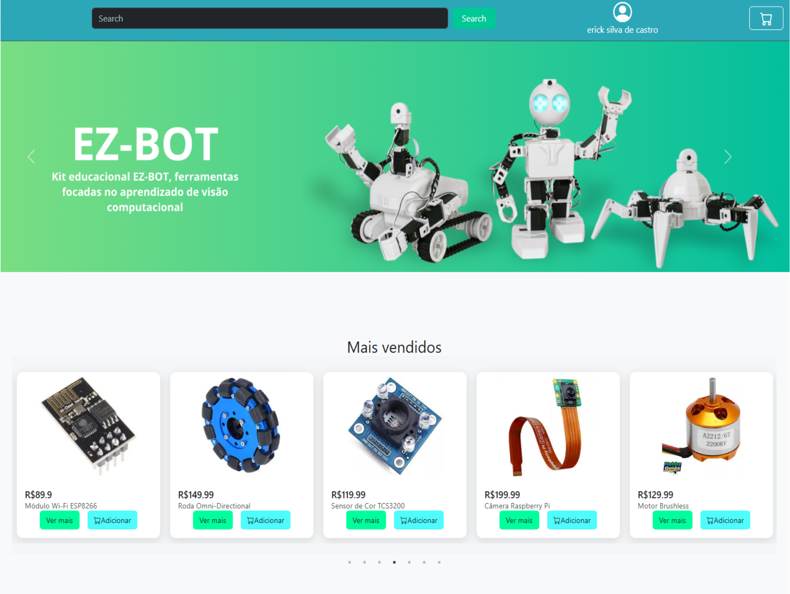

<h1>Casa da Robotica</h1>




> Projeto de loja virtual para produtos de robotica e eletronica.

### Ajustes e melhorias

O projeto ainda está em desenvolvimento e as próximas atualizações serão voltadas para as seguintes tarefas:

- [x] Frontend
- [x] Backend
- [x] Funcionalidades e rotas
- [ ] Responsividade
- [ ] Api de pagamento

## 💻 Pré-requisitos

Antes de começar, verifique se você atendeu aos seguintes requisitos:

- Você instalou as versões mais recentes das seguintes dependências:
  
     `[Python 3.10+](https://www.python.org/downloads/) com [Flask](https://flask.palletsprojects.com/)`
  
     `[Node.js 18+](https://nodejs.org/) com [Vite](https://vitejs.dev/) e [Vue 3](https://vuejs.org/)`
- Você tem uma máquina `<Windows / Linux / Mac>`. Indique qual sistema operacional é compatível / não compatível.
- Você leu `<guia / link / documentação_relacionada_ao_projeto>`.

## 🚀 Instalando CasaDaRobotica

Para instalar o CasaDaRobotica, siga estas etapas:
```
<Servidor>
cd backend
pip i -r requirements.txt

<Frontend>
cd frontend/e-commerce
npm run dev
```

## ☕ Usando CasaDaRobotica

Para usar CasaDaRobotica, siga estas etapas:

```
<Endereço do projeto na maquina local>
http://localhost:3000


<Api>
http://localhost:5000/
```


## ☕ Endpoints

Para acessar a api utilize as seguintes rotas:

```
Base: http://localhost:5000

📍Endpoints

<Users>
http://localhost:5000/users

/get-user/<id>  [GET] - Acessa as informações do usuario com base no id
/cadastro [POST] - Cadastrar um novo usuario no banco de dados
/login [POST] - Fazer login no sistema

<Products>
http://localhost:5000/products

/listar-produtos [GET] - Acessa todos os produtos registrados no banco de dados
/listar-produts/<id> [GET] - Acessa as informações do produto com base no id
/search [GET] - Acessa todos os produtos com base em um padrão de busca

<pedidos>
http://localhost:5000/pedidos

/newpedido [POST] - Cadastra um novo pedido no banco de dados
/listar-pedidos [GET] - Acessa todos os pedidos registrados no banco com base no id do usuario
/<id>/Amount [GET] - Atualiza a quantidade de produtos em um pedido de um usuario com base no id e na quantidade
/<id>/remover [DELETE] - remove um pedido do banco de dados com base no id

<cards>
http://localhost:5000/Cards

/<id> [GET] - Mostra todos os cartões registrados em um usuario com base no id
/<id> [DELETE] - Deleta um cartão registrado em um usuario com base no id
/ [POST] - Insere um novo cartão em um usuario


Ao realizar o login ou cadastro um token é gerado no LocalStorage este token é utilizado em cada requisição Authorization: Bearer <seu_token_aqui>

```
Adicione comandos de execução e exemplos que você acha que os usuários acharão úteis. Forneça uma referência de opções para pontos de bônus!

## 📫 Contribuindo para <nome_do_projeto>

Para contribuir com <nome_do_projeto>, siga estas etapas:

1. Bifurque este repositório.
2. Crie um branch: `git checkout -b <nome_branch>`.
3. Faça suas alterações e confirme-as: `git commit -m '<mensagem_commit>'`
4. Envie para o branch original: `git push origin CasaDaRobotica / <local>`
5. Crie a solicitação de pull.

Como alternativa, consulte a documentação do GitHub em [como criar uma solicitação pull](https://help.github.com/en/github/collaborating-with-issues-and-pull-requests/creating-a-pull-request).

## 🤝 Colaboradores

Agradecemos às seguintes pessoas que contribuíram para este projeto:

<table>
  <tr>
    <td align="center">
      <a href="#" title="defina o título do link">
          <br>
        <sub>
          <b>steve-erick</b>
        </sub>
      </a>
    </td>
  </tr>
</table>

## 😄 Seja um dos contribuidores

Quer fazer parte desse projeto? Clique [AQUI](CONTRIBUTING.md) e leia como contribuir.

## 📝 Licença

Esse projeto está sob licença. Veja o arquivo [LICENÇA](LICENSE.md) para mais detalhes.
